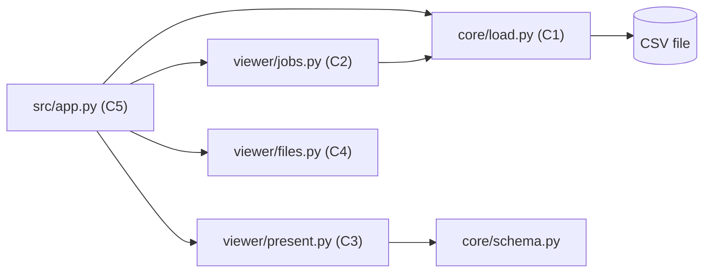
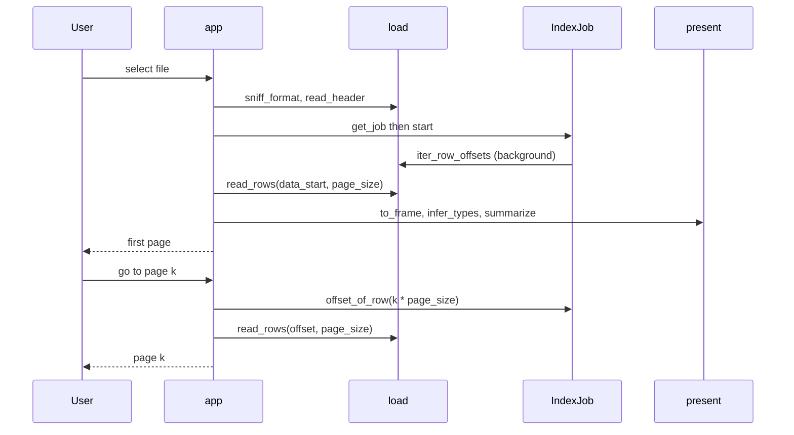

# Component Dependency — csv-viewer

## Dependency Matrix (row depends on column)
| | C1 load | C2 jobs | C3 present | C4 files | schema | streamlit | pandas |
|---|---|---|---|---|---|---|---|
| C1 load | - | | | | | | |
| C2 jobs | X | - | | | | | |
| C3 present | | | - | | X | | X |
| C4 files | | | | - | | | |
| C5 app | X | X | X | X | | X | X |

- 방향은 단방향: `app → viewer.* → load/schema`. `load` 와 `schema` 는 뷰어를 모른다.
- 기존 배치 경로(`run.py → core.__main__`)는 뷰어 모듈을 import 하지 않는다 → streamlit/pandas 가 없어도 배치 CLI 는 동작.

## Diagram



Text alternative:
```
app -> files, load, jobs, present
jobs -> load
present -> schema
load -> CSV file (binary seek)
```

## Communication Patterns
- 모두 동일 프로세스 내 함수 호출.
- C2 ↔ C5: 공유 객체 + `threading.Lock` 보호 스냅샷(`progress()`), 폴링(fragment). 콜백·큐 없음.
- 파일 핸들: IndexJob 스레드와 페이지 읽기는 각자 별도 핸들을 연다 → seek 위치 경합 없음.

## Data Flow


