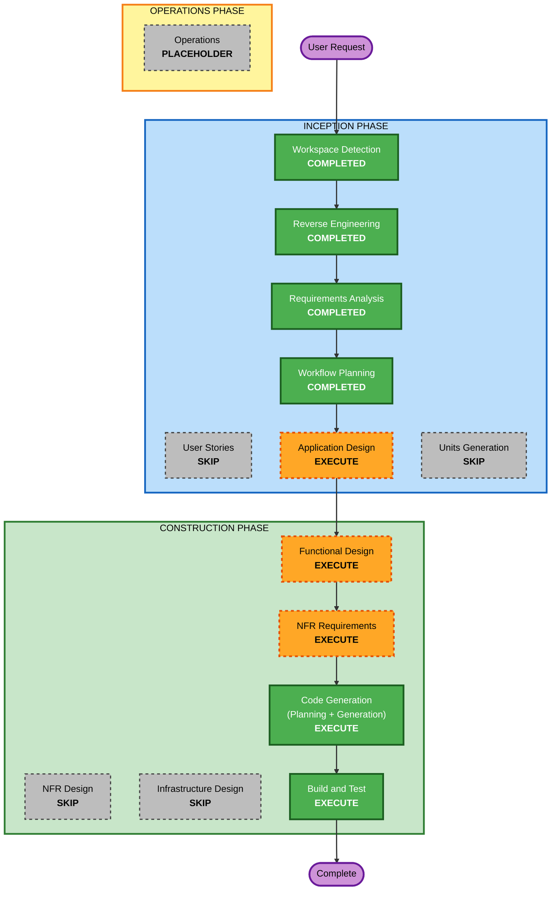

# Execution Plan

## Detailed Analysis Summary

### Transformation Scope (Brownfield)
- **Transformation Type**: Single component addition (새 대화형 뷰어). 아키텍처 전환 아님 — 기존 배치 CLI 는 그대로.
- **Primary Changes**: 페이지 단위 CSV 리더(오프셋 인덱스, 구분자 감지), Streamlit 뷰어 패키지, 새 진입점 `src/app.py`
- **Related Components**: `src/core/load.py`(포맷 지식 위치), `src/core/schema.py`(`NULL_TOKENS`, `is_null` 재사용), `src/core/synth.py`(데모/테스트 데이터), `requirements*.txt`, `TODO.md`, `.gitattributes`(필요 시)

### Change Impact Assessment
- **User-facing changes**: Yes — 새 웹 UI
- **Structural changes**: Yes (경미) — 두 번째 진입점 추가. 배치 CLI 경로는 불변
- **Data model changes**: Yes — 오프셋 인덱스, 페이지, 포맷 감지 결과 자료구조 신설
- **API changes**: No — 기존 내부 API(`load_csv`, `validate` 등) 시그니처 불변
- **NFR impact**: Yes — 첫 페이지 지연·페이지 이동 지연·메모리 상한, Python 3.14 의존성 고정

### Component Relationships
- **Primary Component**: `src/core` (새 모듈 추가)
- **Infrastructure Components**: 없음
- **Shared Components**: `schema.NULL_TOKENS`/`is_null` (재사용, Minor), `synth.generate` (테스트용, 변경 없음)
- **Dependent Components**: 없음 (뷰어를 호출하는 다른 코드 없음)
- **Supporting Components**: `requirements.txt`(Configuration-only, Critical), `requirements-dev.txt`(hypothesis 추가, Important), `TODO.md`(Important)

### Risk Assessment
- **Risk Level**: Low–Medium (격리된 추가. 미지수는 Streamlit 재실행 모델에서의 백그라운드 인덱싱, 3.14 wheel 가용성)
- **Rollback Complexity**: Easy (새 파일 삭제 + requirements 되돌림)
- **Testing Complexity**: Moderate (인덱서 정확성은 PBT 로, UI 는 수동)

## Workflow Visualization



### Text Alternative
```
INCEPTION
- Workspace Detection ........ COMPLETED
- Reverse Engineering ........ COMPLETED
- Requirements Analysis ...... COMPLETED
- User Stories ............... SKIP
- Workflow Planning .......... COMPLETED
- Application Design ......... EXECUTE
- Units Generation ........... SKIP
CONSTRUCTION (single unit: csv-viewer)
- Functional Design .......... EXECUTE
- NFR Requirements ........... EXECUTE
- NFR Design ................. SKIP
- Infrastructure Design ...... SKIP
- Code Generation ............ EXECUTE
- Build and Test ............. EXECUTE
OPERATIONS
- Operations ................. PLACEHOLDER
```

## Phases to Execute

### INCEPTION PHASE
- [x] Workspace Detection (COMPLETED)
- [x] Reverse Engineering (COMPLETED)
- [x] Requirements Analysis (COMPLETED)
- [x] User Stories (SKIPPED)
  - **Rationale**: 단일 사용자 유형, 프로토타입. 요구사항 문서의 FR 로 충분
- [x] Execution Plan (IN PROGRESS)
- [ ] Application Design - EXECUTE (minimal depth)
  - **Rationale**: 새 컴포넌트(리더/인덱서/백그라운드 인덱싱 관리자/UI)와 그 경계, 기존 `load.py`·`schema.py` 와의 관계, 파일 배치를 확정해야 함
- [ ] Units Generation - SKIP
  - **Rationale**: 단일 유닛(`csv-viewer`)으로 충분. 분해할 서비스·패키지가 없음

### CONSTRUCTION PHASE
- [ ] Functional Design - EXECUTE
  - **Rationale**: 따옴표 인지 오프셋 인덱싱, 페이지↔오프셋 매핑, 구분자 감지, 페이지 타입 추론/요약 규칙이 핵심 알고리즘. PBT 대상 성질(Testable Properties)도 여기서 정의
- [ ] NFR Requirements - EXECUTE (minimal depth)
  - **Rationale**: Python 3.14 기준 streamlit/pandas/hypothesis 버전 고정, 지연·메모리 목표의 측정 방법 확정, PBT-09 프레임워크 선택(강제 규칙)
- [ ] NFR Design - SKIP
  - **Rationale**: 성능 패턴(백그라운드 스레드, 캐시 키, 체크포인트 간격)은 Application/Functional Design 에서 함께 다룰 만큼 작음
- [ ] Infrastructure Design - SKIP
  - **Rationale**: 클라우드/배포 인프라 없음. 로컬 `streamlit run`
- [ ] Code Generation - EXECUTE (ALWAYS)
  - **Rationale**: 구현 및 테스트 작성
- [ ] Build and Test - EXECUTE (ALWAYS)
  - **Rationale**: 3.14 venv 설치, 기존+신규 테스트, 수동 UI 검증, 성능 측정 절차

### OPERATIONS PHASE
- [ ] Operations - PLACEHOLDER

## Package Change Sequence
1. `requirements.txt` / `requirements-dev.txt` — 3.14 wheel 확인 후 고정 (이후 모든 단계의 전제)
2. 리더 모듈(포맷 감지·오프셋 인덱스·페이지 읽기) + 테스트 — UI 와 독립적으로 검증 가능
3. 뷰어 패키지(백그라운드 인덱싱, 표 포맷, 페이지 요약)
4. `src/app.py` 진입점
5. `TODO.md` / `SCAFFOLD.md` 갱신

## Estimated Timeline
- **Total Stages to Execute (remaining)**: 5 (Application Design, Functional Design, NFR Requirements, Code Generation, Build and Test)
- **Estimated Duration**: 단계별 승인 대기 제외 시 수 시간 이내

## Success Criteria
- **Primary Goal**: 큰 CSV 를 선택하면 1초 안에 첫 100행이 가독성 있게 보이고, 페이지를 자유롭게 오갈 수 있다
- **Key Deliverables**: 리더 모듈, 뷰어 패키지, `src/app.py`, 테스트(예제+PBT), 고정된 requirements, 갱신된 TODO.md
- **Quality Gates**:
  - 기존 테스트 전부 통과 (NFR-6)
  - 인덱서 PBT 통과: 오프셋으로 읽은 페이지 == 순차 파싱 결과
  - 합성 1GB 파일로 첫 페이지 지연 측정
  - 스캐폴드 규칙 위반 없음 (src 내 LLM import, 데이터 파일, 개인 절대 경로)
- **Integration Testing**: 리더 ↔ 뷰어 ↔ Streamlit 수동 시나리오 (선택→첫 페이지→인덱싱 진행→임의 점프→파일 교체)
