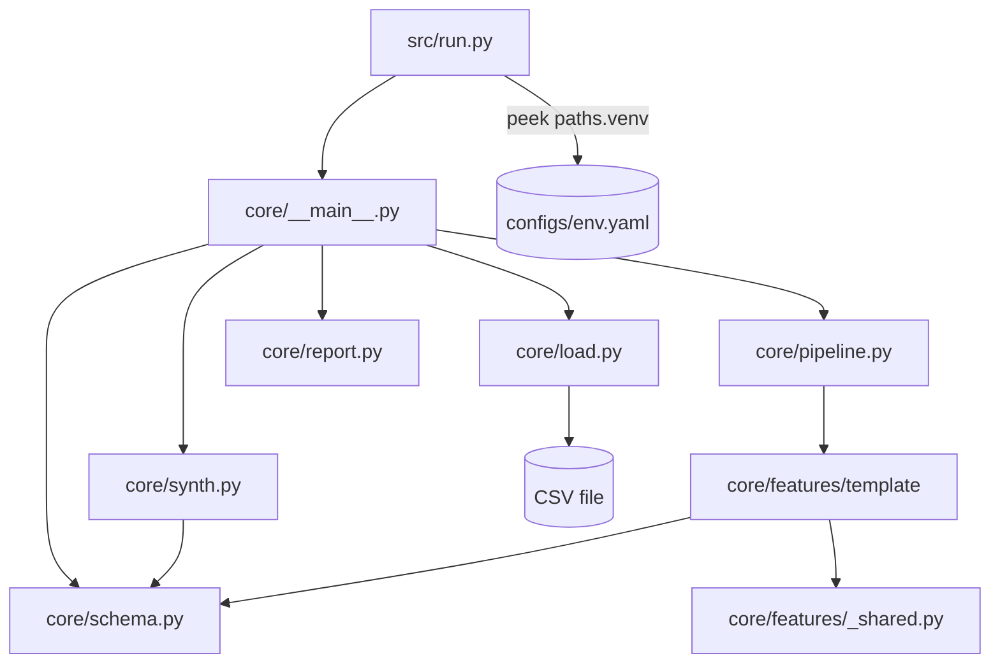
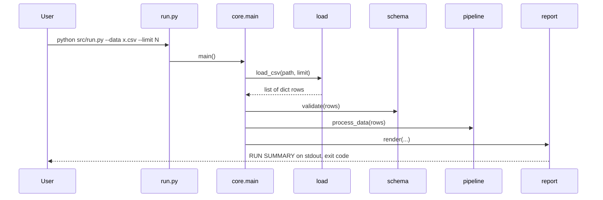

# System Architecture

## System Overview
Single-process Python CLI, standard library only (no runtime third-party deps). Linear batch
pipeline; console text is the only output. No web/UI layer, no services, no database, no cloud infra.

## Architecture Diagram



Text alternative:
```
run.py -> core.__main__ -> {load | synth} -> schema.validate -> pipeline.process_data -> report.render
pipeline -> features/template -> _shared.tally, schema.is_null
```

## Component Descriptions
### core/load.py
- **Purpose**: Only place that knows the input format.
- **Responsibilities**: `load_csv(path, limit)` via `csv.DictReader`, `utf-8-sig`, reads first `limit` rows eagerly into `list[dict]`.
- **Dependencies**: stdlib `csv`. **Type**: Application
### core/schema.py
- **Purpose**: Single source of truth for input structure; validation report.
- **Dependencies**: stdlib. **Type**: Model
### core/pipeline.py + features/
- **Purpose**: Feature registry; merges metrics, raises on name collision.
- **Type**: Application
### core/report.py
- **Purpose**: Render RUN SUMMARY (display-width aware, no data values).
- **Type**: Application
### core/synth.py
- **Purpose**: Synthetic data from schema (normal/adversarial). Replaces fixture files.
- **Type**: Application/Test support
### core/__main__.py
- **Purpose**: argparse, flow, exit codes (0 ok, 1 schema mismatch, 2 could not start).

## Data Flow



## Integration Points
- **External APIs**: None.
- **Databases**: None.
- **Third-party Services**: None.

## Infrastructure Components
- **CDK Stacks**: None.
- **Deployment Model**: git tag + `scripts/sync.sh` copies archive into `{AA}/.staging` and swaps; runs with an existing (possibly shared) Python 3.14 venv.
- **Networking**: N/A.
