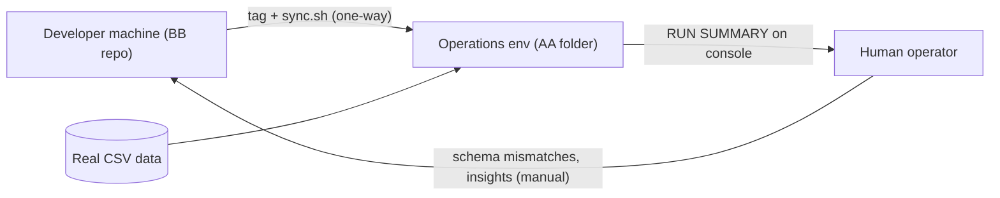

# Business Overview

## Business Context Diagram



Text alternative:
```
Developer repo --(tag + sync.sh, one-way)--> Operations folder
Real CSV --> Operations folder --(console RUN SUMMARY)--> Human
Human --(hand-copied schema mismatches / insights)--> Developer repo
```

## Business Description
- **Business Description**: The repository is a reusable *scaffold* (template) for a batch
  data-validation CLI. It is developed without real data on a dev machine, shipped one-way to
  an isolated operations environment, run against real CSV files there, and its only output
  is a console "RUN SUMMARY" that a human copies by hand. It does NOT yet contain any
  CSV-viewer or Streamlit functionality; the domain schema is placeholder
  (`customer_id`, `amount`, `grade`, `legacy_memo`).
- **Business Transactions**:
  - **BT1 Dry run**: generate synthetic rows from the schema -> validate -> compute metrics -> print RUN SUMMARY.
  - **BT2 Real run**: load CSV (optionally first N rows) -> validate -> compute metrics -> print RUN SUMMARY, exit code 0/1/2.
  - **BT3 Ship**: tag -> `scripts/sync.sh <tag>` preflight on dev; same script deploys and re-checks on ops.
- **Business Dictionary**:
  - **Schema / Field**: declared input columns with dtype, nullability, allowed values, range.
  - **Violation**: schema mismatch on a field the pipeline reads (affects verdict, exit 1).
  - **Note**: mismatch on an unused/undeclared field (informational only).
  - **Feature**: an independent unit under `features/<name>/` exposing `process_data(rows) -> dict`.
  - **RUN SUMMARY**: the single console report; must not print real data values (C3).
  - **C1-C9**: constraints in IMPLEMENTATION_SPEC.md (one-way ship, no data exfiltration, Python 3.14 shared venv, no LLM in src, copy must look like an ordinary program).

## Component Level Business Descriptions
### src/run.py
- **Purpose**: Entry point; optional venv switch from `configs/env.yaml`, then delegate.
### src/core (package)
- **Purpose**: Load -> validate -> process -> report pipeline.
- **Responsibilities**: CLI parsing, CSV loading, schema validation, synthetic data, feature registry, console report.
### scripts/sync.sh
- **Purpose**: One-way deployment and surface checks (no dev files, no data files, no workflow vocabulary).
### tests/
- **Purpose**: Enforce scaffold rules (pipeline contract, schema reporting, spec compliance).
