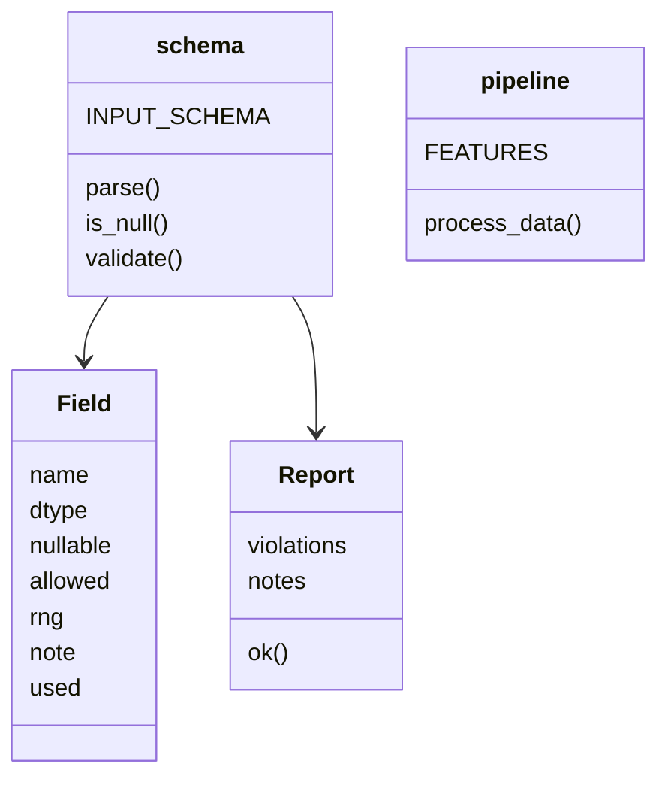

# Code Structure

## Build System
- **Type**: None (plain Python, pip + venv). `requirements.txt` (runtime, currently empty), `requirements-dev.txt` (pytest 9.1.1, anthropic 0.75.0).
- **Configuration**: `configs/env.example.yaml` (`paths.venv`), `.gitattributes` export-ignore list, `.gitignore` blocks data extensions incl. `*.csv`.

## Key Classes/Modules

### Existing Files Inventory
- `src/run.py` - entry point, venv switch via `os.execv`
- `src/core/__main__.py` - CLI args, run order, exit codes
- `src/core/load.py` - CSV loader (eager, optional row limit)
- `src/core/schema.py` - `Field`, `INPUT_SCHEMA` (placeholder), `validate`
- `src/core/synth.py` - synthetic data generator
- `src/core/pipeline.py` - feature registry and metric merge
- `src/core/report.py` - RUN SUMMARY renderer
- `src/core/features/_shared.py` - `tally()` helper
- `src/core/features/template/__init__.py` - copyable feature template
- `scripts/sync.sh` - deployment + surface checks (export-ignored)
- `tests/test_run.py`, `test_schema.py`, `test_pipeline.py`, `test_adopt.py`, `test_spec_compliance.py`, `conftest.py`
- Docs: `SCAFFOLD.md`, `TODO.md`, `todo/scripting.md`, `IMPLEMENTATION_SPEC.md`

## Design Patterns
### Feature registry
- **Location**: `pipeline.py` `FEATURES` tuple. **Purpose**: add features without touching load/schema/report. **Implementation**: modules exposing `NAME` + `process_data(rows)`.
### Schema-as-code + synthetic data
- **Location**: `schema.py`, `synth.py`. **Purpose**: no data files in repo (C3/C6).
### Fail-early with graded exit codes
- **Location**: `__main__.py`. **Purpose**: scripts branch on 0/1/2.

## Critical Dependencies
### Python stdlib only (runtime)
- **Version**: target Python 3.14 (dev machine currently 3.13.1). **Usage**: everything.
### pytest
- **Version**: 9.1.1. **Usage**: tests (dev only).
