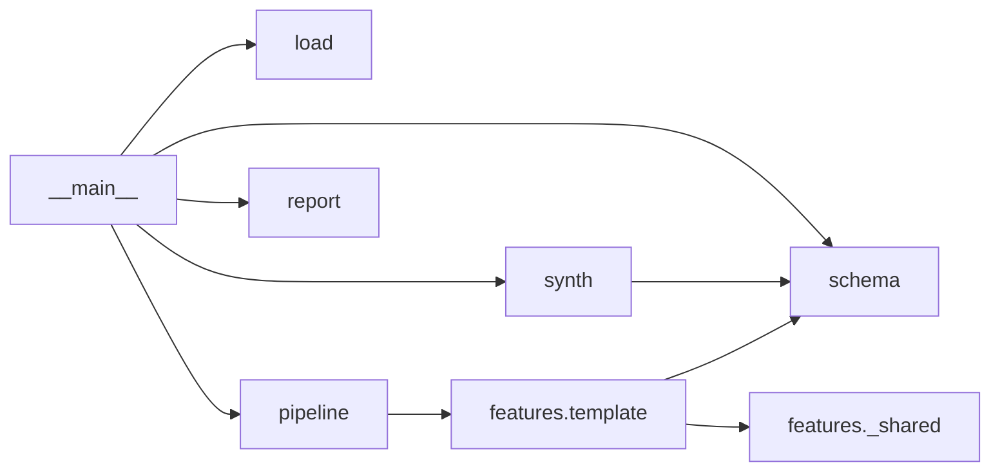

# Dependencies

## Internal Dependencies

### __main__ depends on load, schema, synth, pipeline, report
- **Type**: Runtime. **Reason**: orchestrates the run.
### synth depends on schema
- **Type**: Runtime. **Reason**: generates rows from `INPUT_SCHEMA`.

## External Dependencies
### pytest
- **Version**: 9.1.1. **Purpose**: tests (dev only). **License**: MIT
### anthropic
- **Version**: 0.75.0. **Purpose**: dev-only tooling (must never be imported in `src/`). **License**: MIT
